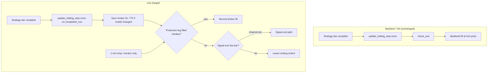

# Execution & Trailing Stop Design

**Status:** Phase 1–2 implemented in `core/execution.py` (2026-05-19); Phase 3 partial (trail OCA retries, slippage reporting, dashboard `live_exit_type`, 2026-05-20)  
**Last updated:** 2026-05-19  
**Scope:** Trend strategy live paper/live execution vs backtest/GA parity — **all exit types**  
**Decision:** Backtest **keeps** bar OHLC exit logic; live moves to broker-authoritative protective exits (stop/TP) with bar-aligned trailing, and signal exits only where the strategy has no broker leg.

---

## 1. Problem statement

Live paper trading diverges from backtest/GA on matched trades (~$200–900 per trade in recent samples) despite similar entry timing and ~13-minute hold duration. Forensic review shows the gap is driven primarily by **execution mechanics**, not hold-time bugs or orphan closes (those are separate edge cases).

The live stack today mixes:

- Broker bracket stops (initial SL from `setup_position`, then erroneous early OCA tighten from 1-min trail)
- Software evaluation of **all** `check_exit` reasons on **completed 13-min bar OHLC**
- **Market flatten** after **canceling** broker stop/TP for stop loss (and the same pattern for TP / channel when triggered via strategy signal)
- Trailing ratchet driven on **1-min** `check_exits` using **1-min** high/low/ATR while strategy/backtest use **13-min** bars

This document defines **industry-aligned live behavior** for **every exit path** while **preserving backtest OHLC semantics** for research and GA.

---

## 2. Definitions

| Term | Meaning |
|------|---------|
| **Strategy bar** | Resampled bar at `Timeframe (minutes)` (e.g. 13-min). Backtest and signal logic use this clock. |
| **Model stop** | `position_dict['stop']` in memory; starts at `initial_sl_pct` from `setup_position()`; chandelier ratchet only after `trailing_delay`. |
| **Working stop** | Resting IB `StopOrder` (auxPrice / stopPrice) in the OCA bracket. |
| **Working TP** | Resting IB `LimitOrder` in the OCA bracket (when TP enabled). |
| **Soft exit** | Bot decides exit from bar logic, cancels broker legs, sends `MarketOrder` (legacy path — remove for SL/TP). |
| **Hard exit** | Broker child order fills when market trades through trigger/limit (± slippage). |
| **Signal exit** | Strategy rule with no dedicated resting order (e.g. channel reversal); live may use limit-at-hint or market after bracket cancel, with explicit label. |
| **Trailing stop (industry)** | Ratchet-only protective stop; **exit fill attributed to the stop order**, not a discretionary market flatten. |

---

## 3. Industry reference (condensed)

Production futures algos typically use **bot-managed resting stops** (pattern B) or **hybrid** (pattern D):

1. **Ratchet rule:** Stop only tightens (up for long, down for short).
2. **Update cadence:** Explicit schedule (e.g. once per completed strategy bar).
3. **Exit authority:** Broker stop/limit fill is primary; software flatten is **fallback** (reject, missing order, disconnect, RTH/maintenance).

**Bar-based research backtests** (pattern C for fills) are valid for GA **if live is not claimed to match fill price**. This project intentionally **splits**:

- **Backtest / GA:** OHLC / close rules in `check_exit` with idealized fill prices (unchanged).
- **Live:** Broker children are source of truth for **stop and TP**; signal exits (channel) and scheduled flatten (RTH/maintenance) use documented discretionary paths.

---

## 4. Current behavior (as-built)

### 4.1 Backtest / GA

Per completed strategy bar (same order every bar):

1. `update_trailing_stop()` once — first bar after entry only sets `bars_held = 1` (no ratchet); further bars increment `bars_held` until `bars_held >= trailing_delay`, then chandelier ratchet may tighten `position['stop']`.
2. `check_exit()` — stop (low/high vs model stop), TP (close vs target), channel (donchian breach), maintenance/RTH flags.
3. Idealized exit price from `check_exit` return value.

**Initial stop during delay:** `setup_position()` sets `stop` from `initial_sl_pct`. Until `trailing_delay` strategy bars elapse, `update_trailing_stop` does **not** ratchet — model stop stays at that initial level. Live must mirror this at the broker.

**`trailing_delay` resolution:** `TrendStrategy._resolve_trailing_delay_bars()` converts `Trailing Delay (minutes)` → bars via timeframe, or uses `Trailing Delay (bars)` directly. Production CSV may use minutes; semantics are always **strategy bars** after resolution.

**Files:** `backtest.py`, `optimize.py` / `BB_Genetic_v4.py`, `strategies/trend/strategy.py` (`check_exit`, `update_trailing_stop`).

### 4.2 Live

| Step | When | What happens |
|------|------|----------------|
| Entry | 13-min signal bar | Market entry + bracket SL/TP at `setup_position()` prices. |
| Trail (broker) | **Every 1-min** + 13-min bar | `update_trailing_stop` on **1-min** row; `bars_held` increments per call → delay and ratchet wrong vs backtest. |
| Trail (log) | Seconds after entry | `Trailing OCA pair replaced` — often before first **strategy** bar (bug). |
| Exit signal | 13-min bar close | `check_exit` for **any** reason → `STRATEGY SIGNAL EXIT` → cancel bracket → **market**. |
| Exit fill | Immediately after | Broker stop/TP **not** filled; market price at bar close (or worse). |

**Same-bar ordering bug:** On the 13-min path, `check_exit` → `_force_close_position` runs **before** `update_trailing_stop` in `check_exits` — stop can fire on a bar before trail is applied for that bar.

**Files:** `core/monitoring.py`, `core/execution.py`, `strategies/trend/strategy.py`.

### 4.3 Known consequences

- **Duration ~13 min** is correct for typical trades (not the May 12 orphan pattern).
- **PnL gap:** Backtest credits model prices; live pays **market** after canceling resting orders.
- **Label confusion:** `"Strategy Exit (Stop Loss)"` ≠ broker stop fill; TP/channel suffer the same pattern.
- **Trail cadence mismatch:** 1-min vs 13-min breaks `trailing_delay` and uses wrong bar OHLC for chandelier.

---

## 5. Design principles

1. **Single clock for live trail:** Ratchet model stop and update broker stop **only** on completed **strategy bars**, using **resampled `completed_row`** (not 1-min `iloc[-1]`).
2. **Broker-authoritative protective exits:** Stop loss and take profit = **working stop / working limit fills**. No cancel-then-market for those reasons when the broker leg is active.
3. **Initial stop through trailing delay:** Broker working stop matches model `initial_sl_pct` from entry until the **first ratchet** after `trailing_delay` strategy bars — same as backtest (no early OCA tighten on 1-min ticks).
4. **Strategy-bar processing order:** On each completed strategy bar: **`update_trailing_stop` → sync broker SL/TP if needed → route exits** (never soft SL/TP ahead of trail on that bar).
5. **Backtest unchanged:** Keep OHLC / close semantics in `check_exit` for GA comparability.
6. **Explicit parity layer:** Metricize live vs backtest execution delta (fill price, exit time, trail level at bar close).
7. **Fail-safe:** Missing/rejected/inactive broker legs → backup flatten with explicit reason (including PreSubmitted stop breach).
8. **All exit types in scope:** Stop, TP, channel, opposite-BB TP updates, RTH/maintenance — each has a defined live authority (see §6.6).

---

## 6. Target architecture

### 6.1 Live: entry and initial stop (aligned with backtest)

- Market entry + OCA bracket: working **stop** = `setup_position().stop` (`initial_sl_pct`), working **limit** = model TP when enabled.
- **During `trailing_delay` strategy bars:** Model stop remains initial %; broker stop is **not** ratcheted/replaced except to fix broker/model drift (e.g. tick quantize). `bars_held` advances **once per completed strategy bar** only.
- **After delay:** First chandelier ratchet on a completed strategy bar → OCA replace stop (and TP leg if OCA-linked), same as backtest ratchet timing.
- **No** 1-min `update_trailing_stop` before the first completed strategy bar after entry.

This matches backtest/GA: `bars_held == 0` → first bar sets `bars_held = 1` without ratchet; subsequent bars increment until `bars_held >= trailing_delay`, then ratchet applies.

### 6.2 Live: trailing

On each **completed strategy bar** only:

1. `strategy.update_trailing_stop(position_dict, completed_row, resampled_data)` **once**.
2. If model stop tightened vs working stop → OCA cancel/replace (existing path + `_wait_oca_pair_cancelled`).
3. If model TP changed (e.g. opposite BB) → update working limit on strategy bar only (§6.6).
4. On replace failure: revert model, log, retry (Phase 3).

**Do not** call `update_trailing_stop` from 1-min `check_exits(..., allow_strategy_exit=False)` — pass `skip_trailing=True` in `monitoring.py`.

### 6.3 Live: stop loss (primary — broker)

- Resting stop active between bar updates; may fill **intrabar** (timing may differ from backtest bar-close OHLC).
- On stop `Filled`: cancel sibling TP, record **`Broker Stop`**, exit price = fill price.
- **Remove:** `check_exit` Stop Loss → cancel stop → market while stop is `Submitted`/`PreSubmitted` (valid).

### 6.4 Live: take profit (primary — broker)

- Backtest: `check_exit` uses **close** vs TP (not wick) — see strategy comment May 2026 parity.
- Live: resting **limit** in bracket; normal exit = **limit fill** → record **`Broker Take Profit`**, exit price = fill price.
- **Remove:** `check_exit` Take Profit → cancel bracket → market while limit is active.
- Opposite-BB mode: `_update_opposite_bb_tp` runs **only** on strategy bar hook **after** trail, adjusting the working limit — not on 1-min ticks.

### 6.5 Live: channel and other signal exits

Backtest channel exit: donchian breach on bar range, exit price = donchian level.

Live (no resting channel order):

1. Evaluate **after** `update_trailing_stop` on completed strategy bar.
2. If `check_exit` returns `Channel Exit` (or other non-SL/TP signal):
   - Cancel OCA siblings.
   - Prefer **limit** at `exit_price_hint` when practical; else **market** with reason **`Channel Exit (signal)`** — never labeled as stop/TP broker fill.
3. Do not use this path when stop/TP reason would apply and broker leg is still active.

### 6.6 Exit routing matrix (live target)

| `check_exit` reason | Backtest fill | Live authority | Live completed-trade reason |
|---------------------|---------------|----------------|----------------------------|
| Stop Loss | `stop_price` (OHLC) | **Broker stop** fill | `Broker Stop` |
| Take Profit | `tp_price` (close rule) | **Broker limit** fill | `Broker Take Profit` |
| Channel Exit | donchian hint | Signal: limit@hint or market | `Channel Exit (signal)` |
| Maintenance Exit | close | Scheduled flatten (software) | `Maintenance Exit` |
| RTH Exit | close | Scheduled flatten (software) | `RTH Exit` |
| (inactive stop + breach) | N/A | Backup on strategy bar or intrabar | `Software Stop (backup)` |
| PreSubmitted breached | N/A | Existing force-close path | `Software Stop (backup)` or `Broker Stop (degraded)` |

**1-min loop:** Poll position/order state only (`skip_trailing=True`, no `check_exit` soft paths). Detect broker fills; run backup only when protective leg inactive.

### 6.7 Live: backup and scheduled exits

**Backup** (same strategy bar if broker stop inactive and model breached; do not wait an extra bar):

- Working stop not active (Inactive, Cancelled, rejected), position open, model stop breached.
- Stop replace failed after retries and position unprotected.
- PreSubmitted stop breached with trigger held (existing path → reclassify as `Software Stop (backup)`).

**Scheduled** (unchanged intent, clear labels):

- RTH / maintenance: `_close_all_positions` — not conflated with strategy stop/TP.

### 6.8 Backtest (explicitly unchanged)

Retain `strategies/trend/strategy.py` `check_exit` and bar loop in `backtest.py` / GA. Optional reporting column `execution_assumption=ohlc_idealized` for comparison to live only.

---

## 7. Current vs target summary

| Concern | Current live | Target live | Backtest |
|---------|--------------|-------------|----------|
| Trail update cadence | ~Every 1 min (1-min OHLC) | Once per strategy bar (`completed_row`) | Once per bar |
| `bars_held` | ~13× too fast on 1-min | Per strategy bar only | Per bar |
| Initial stop during delay | Often early OCA tighten | Hold `initial_sl_pct` until delay elapsed | Initial % until ratchet |
| Strategy bar order | `check_exit` before trail | Trail → sync → exits | Trail → `check_exit` |
| Stop loss | Soft OHLC → market | Broker stop | OHLC @ stop |
| Take profit | Soft → market | Broker limit | Close @ TP |
| Channel exit | Soft → market | Signal limit/market | OHLC @ donchian |
| Exit labels | `Strategy Exit (...)` | Per §6.6 | `Stop Loss`, etc. |
| Parity | Implicit “same” | Explicit non-parity on fill **price/time**; parity on rules & trail **level** | Research truth |

---

## 8. Code touchpoints (implementation map)

| Area | File | Change |
|------|------|--------|
| Phase 1: 1-min trail off | `core/monitoring.py` | 1-min `check_exits(..., skip_trailing=True)`; optional rename to monitor-only. |
| Strategy bar data | `core/execution.py` | Trail/signal only when `latest_row` is strategy `completed_row` (pass resampled row + guard index). |
| Bar order | `core/execution.py` | Move `update_trailing_stop` + broker sync **before** `check_exit` / soft routing on strategy bar. |
| Stop soft exit off | `core/execution.py` | No `_force_close_position` for `Stop Loss` if working stop active. |
| TP soft exit off | `core/execution.py` | No `_force_close_position` for `Take Profit` if working limit active. |
| Channel routing | `core/execution.py` | Dedicated signal path with limit@hint; distinct reason string. |
| Broker fills | `core/execution.py` | Extend `_record_trade_close` reasons: `Broker Stop`, `Broker Take Profit` (stop permId after OCA replace). |
| PreSubmitted | `core/execution.py` | Map to `Software Stop (backup)`. |
| Opposite BB TP | `core/execution.py` | Strategy bar only, after trail. |
| Reason strings | `core/execution.py`, reporting | Full §6.6 vocabulary; `live_exit_type` column. |
| Tests | `tests/` | 1-min does not call `update_trailing_stop`; SL/TP not soft-closed when broker active; channel path; backtest regression unchanged. |

**In scope:** All exit types in §6.6. **Out of scope:** Changing backtest/GA fill simulation or fitness objective.

---

## 9. Observability & acceptance criteria

### 9.1 Logs (live)

- `TRADE OPEN` with model stop/TP = `setup_position` values.
- No `Trailing OCA pair replaced` during `trailing_delay` window except tick/drift correction.
- `Trailing OCA pair replaced` **at most once per strategy bar** after delay.
- Closes: stop/limit **orderId** filled, or explicit `Channel Exit (signal)` / `Software Stop (backup)` / `Maintenance` / `RTH`.

### 9.2 Acceptance criteria

- [ ] No `STRATEGY SIGNAL EXIT: Stop Loss` + market while stop `Submitted`/`PreSubmitted` and position open.
- [ ] No `STRATEGY SIGNAL EXIT: Take Profit` + market while TP limit active and position open.
- [ ] `bars_held` after N **strategy** bars equals expected (not ~13×N on 1-min clock).
- [ ] During `trailing_delay`, broker stop stays at entry `initial_sl_pct` (no chandelier tighten in logs).
- [ ] Typical SL/TP exits show child order `Filled`, not only market order.
- [ ] Channel exits labeled `Channel Exit (signal)`, not `Broker Stop`.
- [ ] Strategy bar processing: trail log line precedes any exit signal log on that bar.
- [ ] Backtest/GA regression unchanged on fixed seed.
- [ ] Compare report: `live_exit_type` ∈ {`broker_stop`, `broker_tp`, `channel_signal`, `software_backup`, `maintenance`, `rth`}.

### 9.3 Parity metrics (reporting, not blocking)

For matched paper vs backtest trades:

- `model_stop_at_exit_bar`, `broker_stop_working`, `backtest_stop_price`
- `live_fill` − `backtest_hint_price` (slippage)
- `exit_time_delta` (bar close vs fill time) — backtest is bar-close idealized

---

## 10. Risks & mitigations

| Risk | Mitigation |
|------|------------|
| IB OCA replace race | `_wait_oca_pair_cancelled`; on fill during replace, do not double-close. |
| Stop inactive (10326, etc.) | Backup soft exit same bar + alert; `prune_dead_brackets`. |
| Worse fill than backtest | Expected for broker paths; report slippage. |
| Gap through stop | Broker fill may slip; backtest idealized. |
| TP limit never fills | Backtest uses close; live may fill earlier/later — document; optional backup if limit rejected. |
| Channel limit not filled | Fallback market with `Channel Exit (signal)` label. |
| Intrabar SL vs bar OHLC | Document timing non-parity; metrics in §9.3. |

---

## 11. Migration plan (phased)

**Phase 1 — Clock fix (low risk)**  
- `skip_trailing=True` on 1-min `check_exits`.  
- Trail only on strategy `completed_row`.  
- `bars_held` only advances on strategy bar hook.

**Phase 2 — Exit authority (all protective + signal routing)**  
- Reorder: trail → broker sync → exit routing.  
- Broker-authoritative SL and TP; remove soft paths for those when legs active.  
- Channel signal path; rename all completed-trade reasons per §6.6.  
- Reclassify PreSubmitted force-close.

**Phase 3 — Hardening**  
- Trail replace retries; execution slippage report; dashboard `live_exit_type`.

**Rollback (two flags recommended):**

| Flag | Effect |
|------|--------|
| `LIVE_TRAIL_STRATEGY_BAR_ONLY=0` | Restores 1-min trailing (debug only). |
| `LIVE_BROKER_AUTHORITATIVE_EXIT=0` | Restores legacy soft cancel+market for SL/TP. |

Use both together for full legacy behavior; partial flags leave inconsistent state.

---

## 12. Resolved decisions (formerly open questions)

| Topic | Decision |
|-------|----------|
| **Initial stop / delay** | Yes — hold `initial_sl_pct` at broker for the same **strategy bars** as backtest (`trailing_delay` after resolution). No chandelier OCA replace until first post-delay ratchet on a completed strategy bar. |
| **Entry bar** | No wide→tight seconds after fill; first broker tighten only when `update_trailing_stop` returns ratchet on a strategy bar. |
| **TP** | Broker limit fill is primary; no bar-close market TP when limit active. Opposite-BB updates on strategy bar only. |
| **Backup timing** | If broker stop inactive and model breached on the **same** 13-min bar, backup flatten that bar (do not wait). |
| **Paper vs live** | Same code path. |

---

## 13. References (code)

- Strategy exits: `strategies/trend/strategy.py` — `check_exit`, `update_trailing_stop`, `_resolve_trailing_delay_bars`
- Backtest bar order: `backtest.py` — `update_trailing_stop` then `check_exit`
- Live dual cadence: `core/monitoring.py`
- Live execution: `core/execution.py` — `check_exits`, `_force_close_position`, `_record_trade_close`, `_update_opposite_bb_tp`
- Params (do not edit production CSV): `strategies/trend/parameters/trend_strategy_params.csv` — `Trailing Delay (minutes)`, `Initial Stop Loss (%)`

---

## Appendix A — Forensic pattern (representative live trade)

**May 17 21:40 SHORT** (illustrates soft exit gap):

| Time | Event |
|------|--------|
| 21:40:07 | Fill SLD @ 7379.25 |
| 21:40:09 | Trail 7455 → 7380.50 *(1-min ratchet — should not happen before delay)* |
| 21:53:06 | 13-min bar; strategy stop @ 7379.50 (high ≥ stop) |
| 21:53:06 | Cancel broker stop; market BOT @ **7391.50** |
| Backtest | Exit ~7380.14 at stop → paper −$612 vs BT +$91 |

Under target design: initial stop held through delay; trail on strategy bars only; cover via **broker stop** ~7380, not discretionary market +12 pts.
