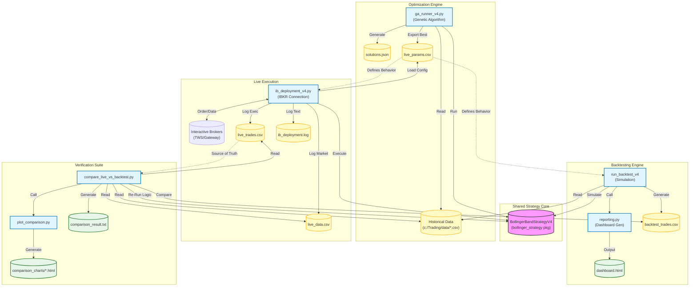

# System Architecture

This diagram illustrates the components of the Bollinger Band Trading Platform, showing how the Strategy Logic, Genetic Algorithm, Live Trading, and Verification tools interact.

## Component Descriptions

1.  **Shared Strategy Core (`bollinger_strategy`):** The "Brain". Contains the exact logic for Entry, Exit, Filters, and Indicators. It is imported by GA, Backtester, and Live Script to ensure logic parity.
2.  **Optimization Engine (`ga_runner_v4`):** Evolves parameters against historical data to find the best configuration, saving it to `live_params.csv`.
3.  **Live Execution (`ib_deployment_v4`):** Runs the strategy in real-time. It reads `live_params.csv`, connects to IBKR, and executes trades. It logs every tick to `live_data.csv` and every trade to `live_trades.csv` (in Eastern Time).
4.  **Verification Suite (`compare_live_vs_backtest`):** The "Auditor". It takes the logs from the Live session and acts as a forensic tool. It re-runs the Backtester using the exact Live Data and Parameters to verify that the code did exactly what it was supposed to do. It produces text reports and visual **Overlay Charts**.
